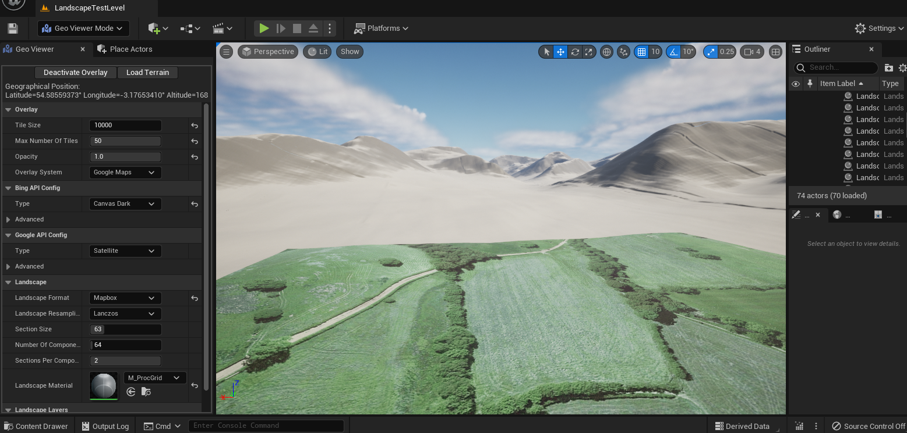

# UE-GeoViewer
### This plugin is still being worked on and not complete.
A plugin for Unreal Engine that overlays real world maps into the editor making it easier to precisely place items in the world and imports real world terrain. 

Using the built in GeoReferencing plugin means the maps can be used on many different projections depending on the place being created in the world and the maps are reprojected to the projected CRS using GDAL.

## Features
- Supports both Google and Bing maps.
- Caches downloaded images to prevent unnecessary API requests.
- Supports any EPSG projection.
- Contains many options such as overlay type, resolution, max number of tiles/decals, decal size.
- Stores settings and API keys in the Editor.ini file.
- Displays current geographical coordinates.
- Imports terrain data in the STRM HGT format or from Mapbox.
- Supports importing GeoTiff landscape weight maps from [Land Cover Mapping](https://github.com/microsoft/landcover)

## Requirements
- UE5 with the GeoReferencing plugin enabled.

## Installation
1. Create a new folder in the plugins folder of the project named 'GeoViewer'.
2. Download or Clone this repository so that the files are in the 'GeoViewer' folder just created.
3. Launch the project, before it starts it should come up with a warning about missing modules and the question, "Would you like to rebuild them now?". Select 'Yes' to this and the plugin should get compiled. This may take a few minutes.
4. Afterwards the editor should launch as normal, and the plugin should be installed.

## Usage
To get started open the 'Geo Viewer' editor mode. This will add two new actors to the world. The first is named 'WorldReferenceSystem', this is used to convert between engine coordinates and geographical coordinates. The second is named 'MapOverlayActor' this will hold the decals that get added when the overlay is active.

### World Reference System
To setup the world origin and projection select the 'WorldReferenceSystem' actor in the details panel some options should appear:
- Planet Shape - At the moment only 'Flat Planet' is supported.
- Projected CRS - This can be changed to a suitable projection for the area the world represents to minimise distortion. [EPSG.io](https://epsg.io/) is a useful website when looking for a CRS to use.
- Geographic CRS - This should be left as 'EPSG:4326'.
- Origin Location - This can be in either projected or geographic coordinates.

### API Keys
All the API keys can be set in the 'Editor Preferences' window under 'Plugins->Geo Viewer'.
- Bing Maps API Key - Used by the overlay when in Bing Maps mode. A key can be created on the [Bing Maps Portal](https://www.bingmapsportal.com/).
- Google Maps API Key - Used by the overlay when in Google Maps mode. A key can be created through the [Google Cloud Console](https://console.cloud.google.com/) for the 'Maps Static API'.
- Mapbox API Key - Used when importing terrain data. A key can be obtained by creating a [Mapbox account](https://www.mapbox.com/).

### Overlay
Other than API keys all settings for the overlay are located in the editor mode panel. Most settings should be fine left with the default values.
'Overlay System' can be changed to select between Google Maps and Bing Maps.

To activate the overlay, press the 'Activate Overlay' button at the top of the panel. This button acts as a toggle so pressing it again will deactivate the overlay.

### Terrain
Digital elevation data can be imported through Mapbox or the HGT STRM format. All '.hgt' files should be placed in `Resources\Terrain\HGT`. Then in the editor there is a 'Load Terrain' button at the top of the GeoViewer editor panel. This will create landscape tiles based on the current geographic position in the viewport. Landscape tiles can be added gradually as the world gets created, but the '.hgt' files must keep their original filename which relates to their geographic position e.g. N00W000.hgt

### Weight Maps
Weight maps can be imported through GeoTiff files generated by [Land Cover Mapping](https://github.com/microsoft/landcover) this uses satalite imagery to predict what the type of ground surface.

After clicking the 'Load Terrain' button a dialog will open (Providing a landscape material was set) with options to select the GeoTiff weight map file. Any GeoTiff files selected should cover part of the area listed on the right side of the window. To make this easier there is a 'Save landscape GeoJson file' button, pressing this will open a window to save a GeoJson file which can then be imported into [Land Cover Mapping](https://github.com/microsoft/landcover) to more easily export the correct section of land.

After all GeoTiff weight maps have been selected, press the 'continue' button and this will crop and merge the weight maps to the correct size before adding them to the landscape actor.

