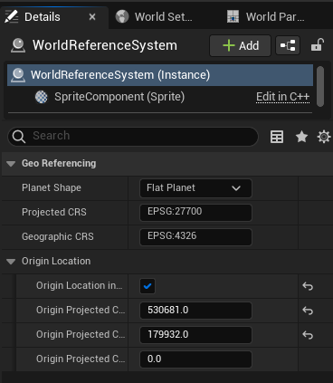

# UE-GeoViewer
A plugin for Unreal Engine that overlays real world maps into the world making it easier to precisely place items in the world. 

Using the built in GeoReferencing plugin means the maps can be used on many different projections depending on the place being created in the world and the maps are reprojected to the projected CRS using GDAL.

## Features
- Supports both Google and Bing maps.
- Caches downloaded images to prevent unnecessary API requests.
- Supports any EPSG projection.
- Contains many options such as overlay type, resolution, max number of tiles/decals, decal size.
- Stores settings and API keys in the Editor.ini file.
- Displays current geographical coordinates.

## Requirements
- UE4.27 with the GeoReferencing plugin enabled.
- [UnrealGDAL plugin](https://github.com/TensorWorks/UnrealGDAL)

## Installation
1. Download the [precomputed version of UnrealGDAL for UE4.27.2](https://github.com/Will747/UnrealGDAL/releases/tag/v0.0.1-UE4.27.2). Alternatively, the plugin can be compiled without precomputed dependency data but would require a source build of Unreal and conan-ue4cli.
2. Copy the folder 'UnrealGDAL' into the plugins folder of the project.
3. Download or Clone this repository.
4. Copy the folder 'GeoViewer' into the plugins folder of the project.
5. Launch the project, before it starts it should come up with a warning about missing modules and the question, "Would you like to rebuild them now?". Select 'Yes' to this and both plugins should get compiled. This may take a few minutes.
6. After that the editor should launch as normal and both plugins should be installed.

## Usage
To get started open the 'Geo Viewer' editor mode. This will add two new actors to the world. The first is named 'WorldReferenceSystem', this is used to convert between engine coordinates and geographical coordinates. The second is named 'MapOverlayActor' this will hold the decals that get added when the overlay is active.

To setup the world origin and projection select the 'WorldReferenceSystem' actor in the details panel some options should appear:
- Planet Shape - At the moment the overlay only supports 'Flat Planet'
- Projected CRS - This can be changed to a suitable projection for the area the world represents to minimise distortion. [EPSG.io](https://epsg.io/) is a useful website when looking for a CRS to use.
- Geographic CRS - This should be left as 'EPSG:4326'.
- Origin Location in Projected - Should be set to false, the origin must be in Longitude and Latitude.
- Origin Latitude and Origin Longitude - This can be set based on the location the map is based.

Then the API keys need adding for either Google or Bing maps, these appear in the Geo Viewer editor mode panel when 'Show API Key' is set to true. The rest of the settings should be fine left with the default values.
'Overlay System' can be changed to select which API to use.

To activate the overlay, press the 'Activate Overlay' button at the top of the panel. This button acts as a toggle so pressing it again will deactivate the overlay.

